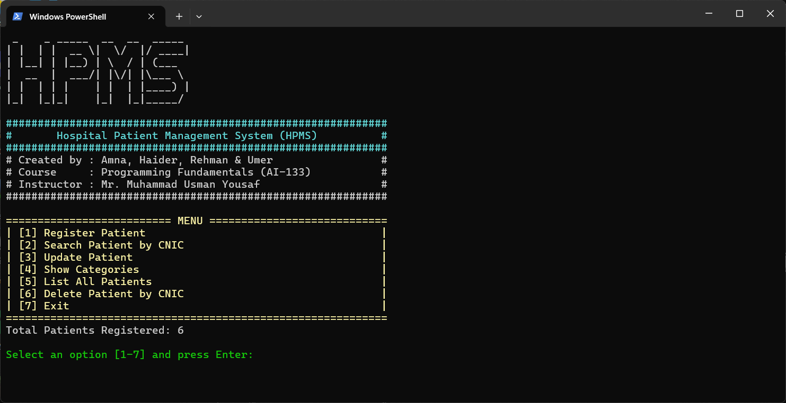

# Hospital Patient Management System (HPMS)

## 📚 Course Information

- **Course Name:** Programming Fundamentals
- **Course Code:** AI-133
- **Semester:** Spring 2025
- **Instructor:** Mr. Muhammad Usman Yousaf

## 👥 Group Members

- Amna
- Haider
- Rehman
- Umer

## 🏥 Project Description

A console-based Hospital Patient Management System developed in C++ for maintaining patient records, searching by CNIC, updating records, and categorizing based on symptoms.

## 💡 Features

- Register new patients
- Search patients by CNIC
- Delete patients by CNIC
- Update existing patient records
- Show categories based on symptoms
- List all patients
- Data persistence using `patients.txt`

## 🖼 Screenshot

Below is the main menu of the Hospital Patient Management System:

## 🛠 Technologies

- C++
- Windows console (uses `windows.h` for colors)

## 🚀 How to Run

1. Open the project in any C++ IDE (e.g., Dev C++, Code::Blocks, Visual Studio)
2. Compile `src/hpms.cpp`
3. Run the executable
4. Ensure `patients.txt` is in the same directory to load/save data

## 🗃 Sample Data File

You can optionally include `data/patients.txt` with sample patient entries.

## 📎 Additional Materials

- [`HPMS_Report.pdf`](docs/HPMS_Report.pdf) – Final report submitted for the course
- [`HPMS_Presentation.pptx`](docs/HPMS_Presentation.pptx) – Presentation slides used during evaluation

> ⚠️ **Disclaimer:**  
> The report and presentation were prepared for an earlier version of the project. Several changes and improvements have since been made to the code based on instructor feedback. As a result, some details in the report and presentation may no longer fully reflect the current version.

## 📄 License

This project is for educational use only. Feel free to modify or enhance it.
