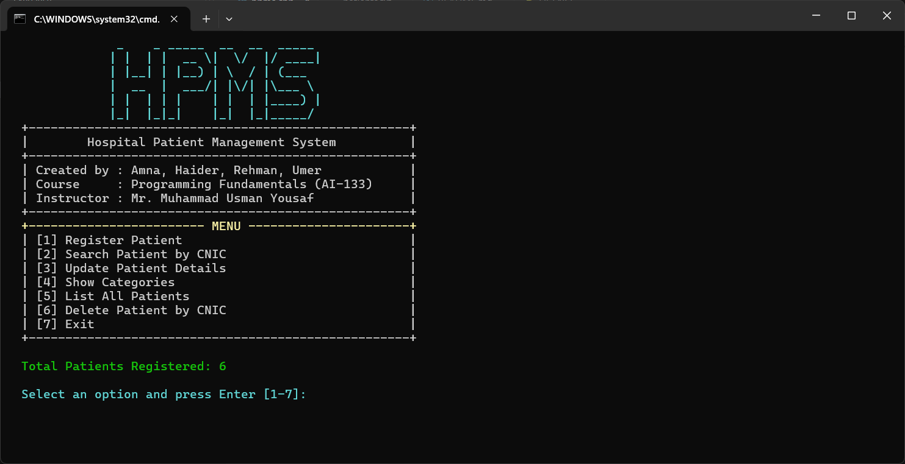

# Hospital Patient Management System (HPMS)

## 📚 Course Information

- **Course:** Programming Fundamentals
- **Course Code:** AI-133
- **Semester:** Spring 2025
- **Instructor:** Mr. Muhammad Usman Yousaf

## 👥 Group Members

- Amna
- Haider
- Rehman
- Umer

## 🏥 Project Description

**HPMS** is a console-based Hospital Patient Management System developed in **C++** for managing patient records. It supports registration, searching, updating, and categorization based on medical symptoms. Originally developed for Windows, the project has been extended for cross-platform compatibility on **Linux**, **macOS**, and **Windows** consoles.

This project is **open source** and available under the [MIT License](LICENSE).

## 💡 Features

- Register new patients
- Search patients by CNIC
- Update existing records
- Delete patients by CNIC
- Categorize patients based on symptoms
- List all patients
- Persistent storage using `patients.txt`

## 🖥 Cross-Platform Console Support

- Works on **Linux**, **macOS**, and **Windows**
- Uses:
  - **ANSI escape codes** for color on Unix-based systems
  - **`windows.h`** for color on Windows
- No external libraries or GUI frameworks required

## 🛠 Technologies Used

- **Language:** C++17
- **Compilers:** `g++`, `clang++`, MSVC, MinGW
- **Build Tools:** Standard command-line
- **Persistence:** Plain text file (`patients.txt`)
- **UI Coloring:** ANSI / `windows.h` (platform-dependent)

## 🚀 How to Compile and Run

### 🐧 Linux/macOS

```bash
g++ -std=c++17 -o hpms src/hpms.cpp
./hpms
```

### 🪟 Windows (Using MinGW)

```bash
g++ -std=c++17 -o hpms.exe src/hpms.cpp
hpms.exe
```

> 📌 Make sure `patients.txt` exists in the `src/` directory for data to persist.

## 🖼 Screenshot

Main menu of HPMS:



## 📂 Project Structure

```
hpms/
├── src/
│   ├── hpms.cpp
│   └── patients.txt
├── docs/
│   ├── hpms_report.pdf
│   └── hpms_presentation.pptx
├── images/
│   └── hpms_preview.png
└── README.md
```

## 📎 Additional Materials

- 📄 [Final Report](docs/hpms_report.pdf)
- 🎞 [Presentation Slides](docs/hpms_presentation.pptx)

> ⚠️ **Note:**  
> The report and slides reflect an earlier version.  
> This repository includes improvements such as cross-platform support and a refactored terminal UI.

## 📄 License

This project is licensed under the [MIT License](LICENSE).
